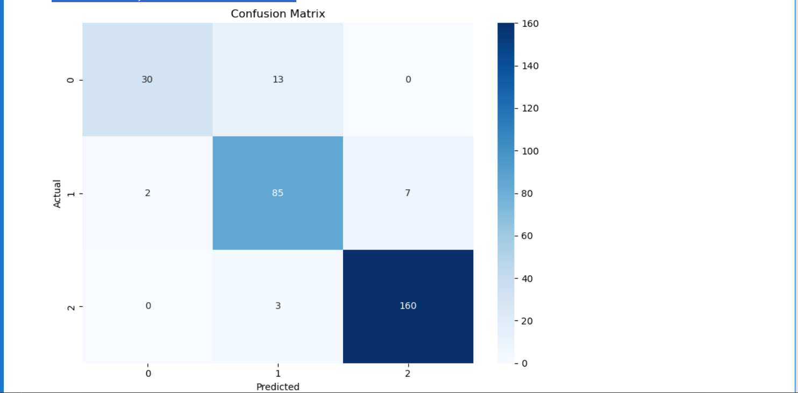
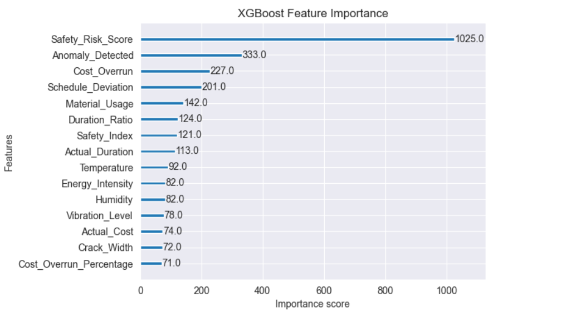

# Predicting Construction Project Delays
*A Data Analytics & Machine Learning Project*

## 📌 Project Overview
Construction delays lead to cost overruns, resource inefficiencies, and stakeholder dissatisfaction. This project applies **data analytics and machine learning** techniques to analyze historical construction project data and **predict the likelihood of schedule delays**.

The objective is to support **data-driven decision-making** in construction planning by identifying key risk factors and building predictive models that can flag potential delays early in the project lifecycle.

---
## Model Performance (Confussion Matrix) and Feature Importance Charts

---

## 🎯 Objectives
- Analyze historical construction project data to understand delay patterns  
- Improve data quality through cleaning, transformation, and feature engineering  
- Identify key variables contributing to construction delays  
- Build and evaluate machine learning models to predict project delays  
- Demonstrate an end-to-end analytics workflow applicable to real-world construction environments  

---

## 🗂️ Dataset Description
The dataset contains historical construction project records with attributes related to:
- Project duration and cost  
- Project type and scope  
- Scheduling and timeline information  
- Categorical and numerical features relevant to construction activities  

> **Note:** The dataset was preprocessed to handle missing values, inconsistent entries, and categorical variables before modeling.

---

## 🔧 Data Processing & Analysis
- Performed **data cleaning** to address missing, duplicate, and inconsistent values  
- Conducted **exploratory data analysis (EDA)** to uncover trends, correlations, and risk drivers  
- Applied **feature engineering** to enhance predictive power  
- Visualized key insights to support interpretation and communication  

---

## 🤖 Machine Learning Approach
- Implemented supervised learning (XGBOOST) model to classify and predict construction delays  
- Evaluated model using appropriate performance metrics  
- Compared model performance to identify the most effective approach for this dataset  

The modeling workflow emphasizes **interpretability and practical relevance** for construction stakeholders.

---

## 📊 Key Insights
- Certain project characteristics significantly influence the likelihood of delays  
- Data quality and feature selection play a critical role in prediction accuracy  
- Predictive analytics can help construction teams proactively manage scheduling risks  

---

## 🛠️ Tools & Technologies
- Python  
- Pandas, NumPy  
- Scikit-learn  
- Data Visualization (Matplotlib / Seaborn)  
- Jupyter Notebook  

---

## 🚀 Future Improvements
- Integrate additional real-world construction datasets  
- Develop interactive dashboards (e.g., Power BI) for stakeholder reporting  
- Enhance model performance using advanced feature engineering  
- Deploy the model as a decision-support tool for construction project managers  

---
